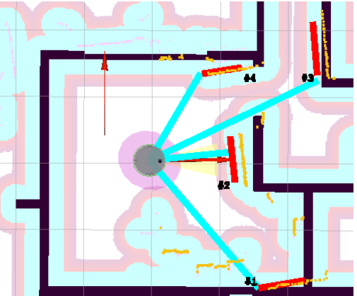
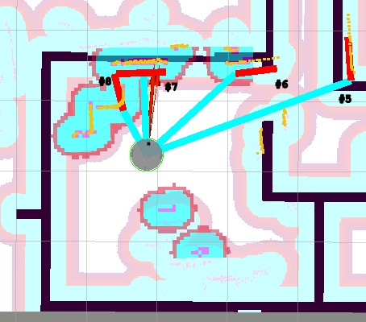
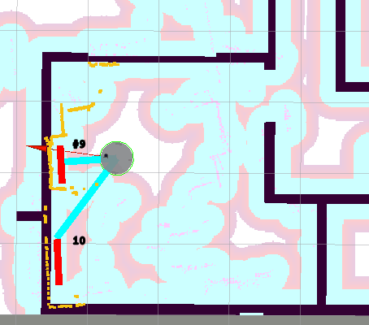
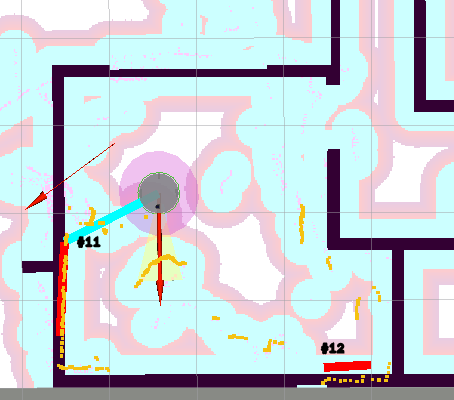

# 241110 Linefinder

---
<font size="1pt">

```markdown
ros@sigyn7900:~$ ros2 launch line_finder line_finder.launch.py 
[INFO] [launch]: All log files can be found below /home/ros/.ros/log/2024-11-10-19-54-19-319020-sigyn7900-5868
[INFO] [launch]: Default logging verbosity is set to INFO
[INFO] [lf-1]: process started with pid [5871]
[lf-1] [INFO] [1731297259.725347787] [LineExtractionROS]: bearing_std_dev: 0.001000
[lf-1] [INFO] [1731297259.725380035] [LineExtractionROS]: frame_id: base_link
[lf-1] [INFO] [1731297259.725382649] [LineExtractionROS]: least_sq_angle_thresh: 0.000100
[lf-1] [INFO] [1731297259.725384994] [LineExtractionROS]: least_sq_radius_thresh: 0.000100
[lf-1] [INFO] [1731297259.725387328] [LineExtractionROS]: max_line_gap: 0.400000
[lf-1] [INFO] [1731297259.725389542] [LineExtractionROS]: max_range: 20.000000
[lf-1] [INFO] [1731297259.725392006] [LineExtractionROS]: min_line_length: 0.500000
[lf-1] [INFO] [1731297259.725394090] [LineExtractionROS]: min_line_points: 9
[lf-1] [INFO] [1731297259.725396204] [LineExtractionROS]: min_range: 0.400000
[lf-1] [INFO] [1731297259.725398247] [LineExtractionROS]: min_split_dist: 0.050000
[lf-1] [INFO] [1731297259.725400191] [LineExtractionROS]: outlier_dist: 0.050000
[lf-1] [INFO] [1731297259.725402104] [LineExtractionROS]: publish_markers: True
[lf-1] [INFO] [1731297259.725403937] [LineExtractionROS]: range_std_dev: 0.020000
[lf-1] [INFO] [1731297259.725405901] [LineExtractionROS]: scan_topic: scan
```

</font>

---
Room corners
| corner | x | y |
|--------|---|---|
| lower-left | 7.51 | 0.155 |
| upper-left | 7.51 | 3.56 |
| upper-right | 10.5 | 3.53 |
| lower-right | 10.5 | 0.155 |

(not including closet area)
---

# /line_segments
## Lines 1-4

| line# | radius | angle | start_x | start_y | end_x | end_y |
|-------|--------|-------|---------|---------|-------|-------|
| 1 | 2.1458 | -1.4208 | 1.6294 | -1.9240 | 2.2307 | -1.8332 |
| 2 | 1.2184 |  0.0882 | 1.2538 | -0.3440 | 1.1921 |  0.3512 |
| 3 | 2.5796 |  0.0856 | 2.4843 |  1.2211 | 2.4165 |  2.0117 |
| 4 | 1.2035 |  1.6928 | 1.4487 |  1.3903 | 0.7851 |  1.3088 |
### Line Segment Data [Lines 1-4]


<details>
<summary>topic data to match table</summary>
<font size=1>

```markdown
header:
  stamp:
    sec: 1731297807
    nanosec: 310063609
  frame_id: base_link
line_segments:
- radius: 2.1458699703216553
  angle: -1.420866847038269
  covariance:
  - 1.9729275679272688e-05
  - -1.1918309603479459e-05
  - -1.1918309603479459e-05
  - 7.298461178386535e-06
  start:
  - 1.6294203545637538
  - -1.9240709449528208
  end:
  - 2.230796309594858
  - -1.8332252501536457
- radius: 1.218483805656433
  angle: 0.08828162401914597
  covariance:
  - 9.653396027243751e-06
  - 1.8190248807880376e-05
  - 1.8190248807880376e-05
  - 0.00017191915647513494
  start:
  - 1.2537025326029294
  - -0.3440791759252431
  end:
  - 1.1921550098627762
  - 0.3512812504865298
- radius: 2.579677104949951
  angle: 0.0856236070394516
  covariance:
  - 1.7251915098513372e-05
  - -1.1945000145414815e-05
  - -1.1945000145414815e-05
  - 8.518800953433596e-06
  start:
  - 2.4843494398054466
  - 1.2211211471218202
  end:
  - 2.4164924712619578
  - 2.011686507466736
- radius: 1.2035443782806396
  angle: 1.6928415298461914
  covariance:
  - 9.616874214378782e-06
  - 7.331284897485949e-06
  - 7.331284897485949e-06
  - 5.729877567940279e-06
  start:
  - 1.4487406154402493
  - 1.3902587609151182
  end:
  - 0.7850872338081254
  - 1.308858485482569
- radius: 1.53309166431427
  angle: 1.571770429611206
  covariance:
  - 4.256913998302961e-05
  - 0.00011316331143330525
  - 0.00011316331143330525
  - 0.0003853242751400809
  start:
  - 0.6775138913609485
  - 1.5337523527000416
  end:
  - 0.14530837367083127
  - 1.53323391269911
```
</font>
</details>

---
## Lines 5-8

| line# | radius | angle | start_x | start_y | end_x | end_y |
|-------|--------|-------|---------|---------|-------|-------|
| 5 | 2.9939 | -1.3857 | 1.2568 | -2.8106 | 1.9011 | -2.6900 |
| 6 | 0.9785 |  0.2195 | 1.3961 | -1.7636 | 1.2547 | -1.1299 |
| 7 | 1.1628 |  0.1217 | 1.1943 | -0.1862 | 1.1178 |  0.4390 |
| 8 | 1.1063 |  0.5420 | 1.1063 |  0.5420 | 0.5643 |  0.3889 |
### Line Segment Data [Lines 5-9]

<details>
<summary>topic data to match table</summary>
<font size=1>

```markdown
header:
  stamp:
    sec: 1731298943
    nanosec: 309821887
  frame_id: base_link
line_segments:
- radius: 2.9939589500427246
  angle: -1.3856724500656128
  covariance:
  - 2.540774519104498e-05
  - -2.312734115665261e-05
  - -2.312734115665261e-05
  - 2.1800444675049303e-05
  start:
  - 1.2567848625299218
  - -2.8106489229208624
  end:
  - 1.901055836874385
  - -2.689997535854568
- radius: 0.9785247445106506
  angle: 0.21951071918010712
  covariance:
  - 8.043113636205821e-06
  - 4.662219890767996e-06
  - 4.662219890767996e-06
  - 2.7400737583088343e-06
  start:
  - 1.3960597615672092
  - -1.7636353804792446
  end:
  - 1.2546780910992883
  - -1.1299373320134127
- radius: 0.22083692252635956
  angle: 1.846121907234192
  covariance:
  - 2.5059073030361064e-06
  - 2.9488013963177136e-06
  - 2.9488013963177136e-06
  - 3.621011101489202e-06
  start:
  - 1.1062934982034736
  - 0.542008032593687
  end:
  - 0.5642952531170367
  - 0.38889341445790165

```
</font>
</details>

---
## Lines 9-10

| line# | radius | angle | start_x | start_y | end_x | end_y |
|-------|--------|-------|---------|---------|-------|-------|
| 9 | 0.7853 |  0.1961 | 0.8128 | -0.0617 | 0.7116 |  0.4478 |
| 10 | 0.8881 |  0.1761 | 0.6804 |  1.2454 | 0.5647 |  1.8959 |
### Line Segment Data [Lines 9-10]

<details>
<summary>topic data to match table</summary>
<font size=1>

```markdown
header:
  stamp:
    sec: 1731300904
    nanosec: 5518646
  frame_id: base_link
line_segments:
- radius: 0.7852584719657898
  angle: 0.1960650533437729
  covariance:
  - 8.190411277388229e-06
  - -1.0550132576650183e-05
  - -1.0550132576650183e-05
  - 0.0003248916215273651
  start:
  - 0.8128473907688508
  - -0.061676902988323415
  end:
  - 0.7116492675112557
  - 0.44783790816531677
- radius: 0.8881112933158875
  angle: 0.17610231041908264
  covariance:
  - 7.177821129194005e-06
  - -4.869043919293237e-06
  - -4.869043919293237e-06
  - 3.3676316832071296e-06
  start:
  - 0.6804435501251853
  - 1.2454312594436618
  end:
  - 0.5646937098911454
  - 1.895910038803841
```
</font>
</details>

---
## Lines 11-12

| line# | radius | angle | start_x | start_y | end_x | end_y |
|-------|--------|-------|---------|---------|-------|-------|
| 11 | 1.0506 | -1.6302 | 0.5476 | -1.0850 | 1.6074 | -1.1480 |
| 12 | 2.0352 |  0.0149 | 2.0075 |  1.8769 | 1.9997 |  2.4022 |
### Line Segment Data [Lines 11-12]

<details>
<summary>topic data to match table</summary>
<font size=1>

```markdown
header:
  stamp:
    sec: 1731301714
    nanosec: 610407075
  frame_id: base_link
line_segments:
- radius: 1.0505529642105103
  angle: -1.6301807165145874
  covariance:
  - 5.6270473175723055e-06
  - -4.521922776098976e-06
  - -4.521922776098976e-06
  - 3.918528040586107e-06
  start:
  - 0.547586052020824
  - -1.084964395917353
  end:
  - 1.6073655621467373
  - -1.147972805943739
- radius: 2.0351946353912354
  angle: 0.014871446415781975
  covariance:
  - 1.981247065111853e-05
  - -9.34070486658777e-06
  - -9.34070486658777e-06
  - 4.432487131092105e-06
  start:
  - 2.007505572217503
  - 1.8768979168479734
  end:
  - 1.9996930674860152
  - 2.4021950877829905
```
</font>
</details>
To save this markdown file as a PDF, you can use a tool like Pandoc. Here are the steps:

1. Install Pandoc if you haven't already. You can install it using the following command:
  ```sh
  sudo apt-get install pandoc
  ```

2. Navigate to the directory containing your markdown file:
  ```sh
  cd /home/ros/sigyn_ws/src/laser_lines/notes/
  ```

3. Convert the markdown file to PDF using Pandoc:
  ```sh
  pandoc note3.md -o note3.pdf
  ```

This will generate a `note3.pdf` file in the same directory.

Alternatively, you can use an online markdown to PDF converter or a markdown editor with built-in PDF export functionality.